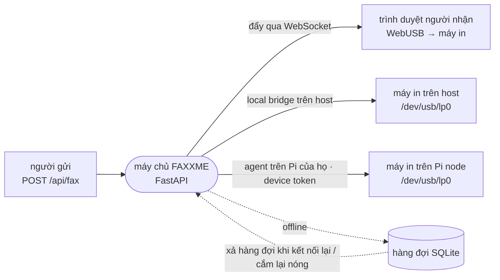
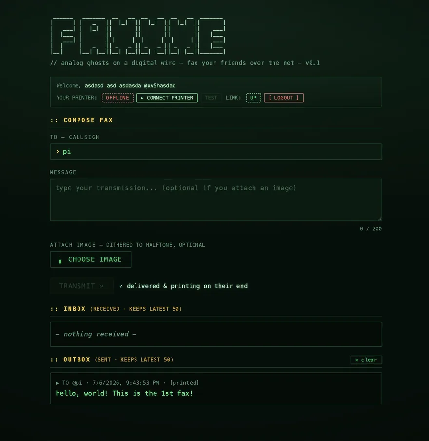
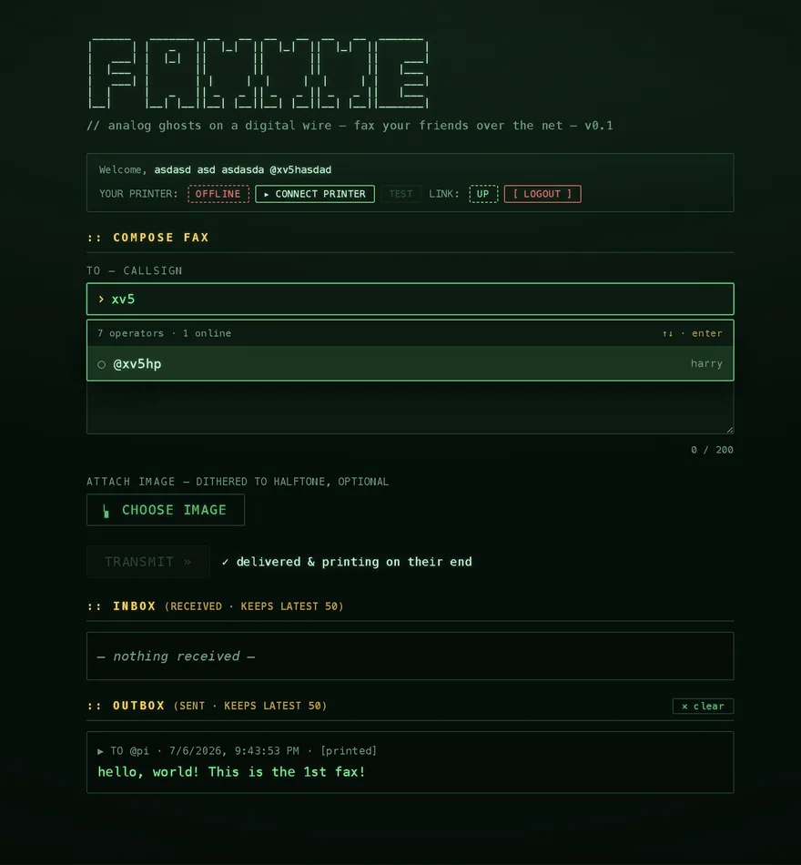
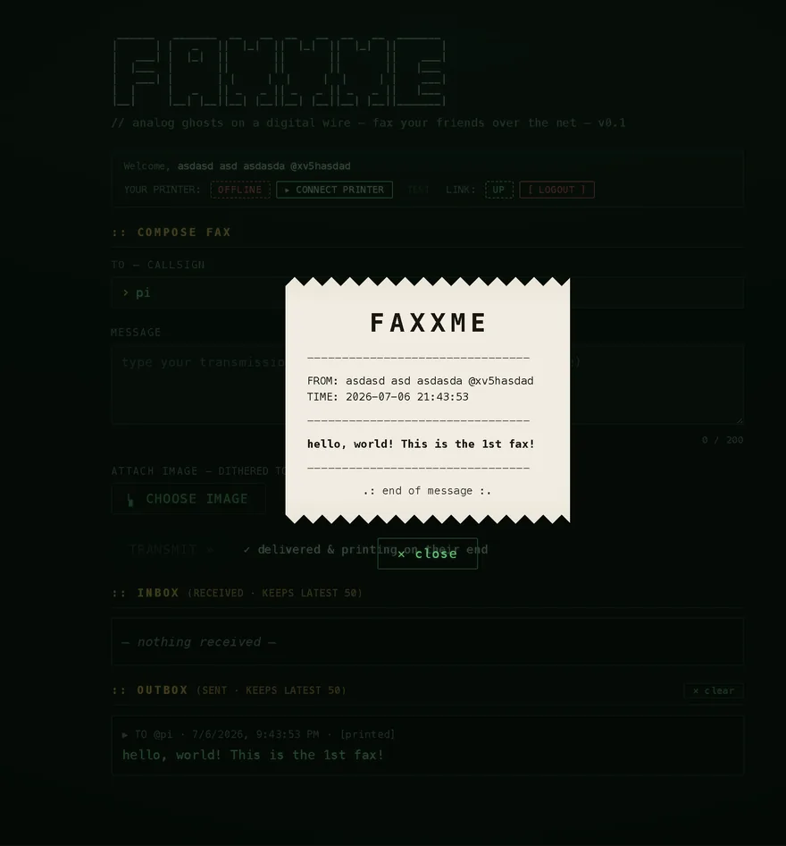
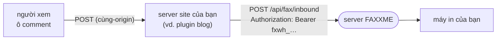

# FAXXME

> 🌐 Ngôn ngữ: [English](README.md) · **Tiếng Việt**

> Những bóng ma analog trên sợi dây số. Đăng ký, kết nối một chiếc máy in, rồi fax cho bạn bè.
> Nếu máy in của họ đang online, bản fax in ra ngay lập tức; nếu không, nó xếp hàng chờ và in
> đúng khoảnh khắc máy in trở lại. Không phải cài app nào cả — chỉ cần một trình duyệt.

Một web app mang phong cách terminal / CRT / hacker. Backend viết bằng Python (FastAPI +
WebSocket), frontend vanilla-JS. Một bản fax được in ra trên chiếc máy in nhiệt vật lý của người
nhận qua một trong **ba đường (path)** — **trình duyệt** của họ (WebUSB), một máy in cắm thẳng
vào **máy chủ** (local bridge — cầu nối cục bộ), hoặc một **agent chạy nền trên chiếc Raspberry
Pi của chính họ** (node in, xác thực bằng device token).



## Ảnh chụp màn hình

| Bảng điều khiển | Tìm người nhận | Xem bản fax đã in |
| :---: | :---: | :---: |
|  |  |  |
| thanh trạng thái · soạn tin · hộp đến/đi | tìm mờ (fuzzy), ưu tiên người online | bấm vào một bản fax → tờ giấy in |

## Tính năng

- **Tài khoản** — đăng ký/đăng nhập, mật khẩu băm bằng pbkdf2 + cookie phiên ký bằng hmac (không phụ thuộc thư viện native nào).
- **Soạn fax** — ô chọn người nhận có tìm kiếm, tin nhắn tối đa 200 ký tự, ảnh đính kèm tùy chọn, bộ đếm ký tự trực tiếp.
- **Ba đường in**
  - *WebUSB qua trình duyệt* — máy chủ dựng sẵn các byte ESC/POS, trình duyệt của người nhận chuyển tiếp nguyên vẹn tới máy in USB (tự bind lại khi cắm lại nóng, không cần bấm).
  - *Local bridge* — một máy in cắm thẳng vào máy chủ sẽ in ngay tại phía máy chủ, không cần trình duyệt.
  - *Node in (agent)* — một [agent](agent/README-vi.md) chạy nền trên chiếc Raspberry Pi của người nhận, xác thực bằng **device token**, in các bản fax ngay tại chỗ.
- **Device token** — token API riêng cho mỗi tài khoản dành cho agent (lưu dạng băm sha256, chỉ hiện một lần); tạo lại (regenerate) để **thu hồi tức thì** (agent đang kết nối sẽ bị ngắt ngay).
- **Trạng thái máy in trực tiếp** — pill PRINTER hiển thị đường in tốt nhất đang có (`ONLINE` USB trình duyệt · `NODE ✓` agent · `WIRED` cầu nối · `OFFLINE`) và cập nhật theo thời gian thực; **TEST** in một trang thử trên bất cứ đường in nào bạn đang có.
- **Chữ Unicode** — những dòng có tiếng Việt, emoji, hay bất cứ ký tự nào bảng mã của máy in không hiển thị được sẽ tự động được dựng bằng font đóng kèm thành một raster `GS v 0` sắc nét; những dòng thuần ASCII vẫn dùng text ESC/POS gốc cho nhanh.
- **Ảnh đính kèm** — được dither Floyd–Steinberg thành halftone 1-bit (raster `GS v 0`), kèm bản xem trước ngay ở phía client.
- **Hàng đợi offline** — các bản fax chưa gửi được nằm chờ trong SQLite và được xả ra khi người nhận (trình duyệt/agent) kết nối lại, hoặc khi máy in trên host được cắm lại nóng (có tiến trình nền canh chừng); hộp đi của người gửi tự lật `queued → printed` ngay lập tức.
- **Cửa sổ xem bản in** — bấm vào bất kỳ bản fax nào để thấy nó như một tờ giấy in (mép giấy rách, ảnh đã dither).
- **Dọn dẹp** — xóa hộp đến/hộp đi (chỉ phía bạn; phía bên kia vẫn giữ bản của họ), tự giới hạn 50 bản mỗi phía, không thể tự fax cho chính mình.
- **Kiểu cắt giấy cấu hình được** — cắt hết / đẩy tới dao cắt / cắt một phần / không cắt.
- **`/healthz`** — endpoint kiểm tra "còn sống" cho Docker / systemd / các dịch vụ giám sát uptime.

## Cơ chế hoạt động

- **Hiện diện (presence) = một WebSocket đang mở.** Khi tab console đang mở là bạn *online*: các bản
  fax được đẩy tới bạn tức thì và bạn bè thấy chấm xanh của bạn.
- **Gửi** (`POST /api/fax`). Nếu người nhận đang online, máy chủ đẩy bản fax qua WebSocket của họ;
  trình duyệt của họ ghi các byte ESC/POS ra máy in USB rồi báo nhận (ack). Nếu họ offline, bản fax
  được **xếp hàng** trong SQLite.
- **Giao khi quay lại.** Fax đang chờ được xả ra khi người nhận kết nối lại (trình duyệt **hoặc**
  agent trên Pi), hoặc — với máy in có dây trên host — khi tiến trình nền thấy thiết bị xuất hiện
  trở lại (kiểm tra mỗi `FAXXME_PRINTER_POLL` giây; xử lý được cả rút/cắm lại mà không cần khởi động lại).
- **Node in = thêm một client WebSocket.** Agent xác thực bằng device token, kết nối cùng một `/ws`,
  rồi ghi các byte ESC/POS được đẩy tới ra máy in cục bộ của nó — nên "người khác in tới tôi" hoạt
  động mà không cần thêm chút logic nào ở máy chủ (dùng lại nguyên vẹn presence, hàng đợi, ack).
- **Một nguồn sự thật duy nhất.** ESC/POS được dựng ở phía máy chủ (`faxxme/printer.py`); trình duyệt
  chỉ chuyển tiếp các byte thô qua WebUSB, còn local bridge / agent ghi đúng những byte đó ra `/dev`.

## Tài liệu

Tài liệu chuyên sâu nằm trong [`docs/vi/`](docs/vi/):

- [Cơ chế hoạt động](docs/vi/how-it-works.md) — kiến trúc, mô hình giao fax, tiến trình canh chừng, xử lý ảnh, token, admin.
- [Tương thích máy in](docs/vi/printers.md) — các máy in nhiệt được hỗ trợ, khổ giấy, kiểu cắt.
- [Ghi chú theo nền tảng](docs/vi/platforms.md) — những điểm cần lưu ý của WebUSB trên Ubuntu / macOS / Windows.
- [Tích hợp webhook](docs/vi/webhook.md) — cho phép bất kỳ site nào fax cho bạn (comment blog, app…): API inbound, ví dụ, bảo mật, quản lý secret key.
- [Node in / agent](agent/README-vi.md) — chạy FaxxMe trên chiếc Pi của bạn (device token, không cần trình duyệt).

## Chạy

```bash
python3 -m venv .venv
.venv/bin/pip install -r requirements.txt

# lắng nghe trên mọi interface; gán máy in có dây của host cho callsign "pi"
FAXXME_LOCAL_USER=pi FAXXME_PRINTER_DEV=/dev/usb/lp0 ./run.sh
# hoặc: FAXXME_LOCAL_USER=pi .venv/bin/python -m faxxme
# -> http://<host>:8000
```

## Cấu hình

Mọi cấu hình đều thông qua biến môi trường:

| biến | mặc định | ý nghĩa |
|-----|---------|---------|
| `FAXXME_HOST` / `FAXXME_PORT` | `0.0.0.0` / `8000` | địa chỉ bind |
| `FAXXME_LOG_LEVEL` | `info` | mức log của uvicorn |
| `FAXXME_LOCAL_USER` | *(không đặt)* | callsign có fax được in trên máy in của CHÍNH host này (bật local bridge) |
| `FAXXME_PRINTER_DEV` | `/dev/usb/lp0` | node thiết bị máy in cho local bridge |
| `FAXXME_PRINTER_POLL` | `4` | số giây giữa các lần kiểm tra cắm-lại-nóng máy in |
| `FAXXME_CUT` | `full` | cắt giấy cuối mỗi bản fax: `full` / `feed` (đẩy tới dao cắt) / `partial` / `none` |
| `FAXXME_WIDTH` | `32` | số cột chữ (58mm ≈ 32, 80mm ≈ 48) |
| `FAXXME_PRINT_DOTS` | `384` | bề rộng raster ảnh tính bằng dot (58mm ≈ 384, 80mm ≈ 576) |
| `FAXXME_IMG_MAX_H` | `1200` | chiều cao ảnh in tối đa (dot) |
| `FAXXME_MAX_UPLOAD` | `6291456` | dung lượng ảnh tải lên tối đa (byte, 6 MB) |
| `FAXXME_FAX_RATE_MAX` / `FAXXME_FAX_RATE_WINDOW` | `20` / `60` | giới hạn tần suất theo người gửi: tối đa N bản fax mỗi N giây (0 = tắt) |
| `FAXXME_WEBHOOK_RATE_MAX` / `FAXXME_WEBHOOK_RATE_WINDOW` | `5` / `300` | giới hạn fax gửi qua webhook, áp theo tác giả **và** theo IP site gọi (0 = tắt) |
| `FAXXME_WEBHOOK_MSG_MAX` | `500` | số ký tự tối đa trong tin nhắn gửi qua webhook |
| `FAXXME_ADMIN_PASSWORD_HASH` | *(không đặt)* | hash sha256 của mật khẩu trang `/admin`; không đặt = tắt admin |
| `FAXXME_FONT` | Play đóng kèm (Google Fonts) | TTF dùng để dựng chữ non-ASCII (tiếng Việt, emoji…) |
| `FAXXME_FONT_SIZE` | `26` | cỡ font khi dựng chữ Unicode |
| `FAXXME_FONT_THRESHOLD` | `176` | ngưỡng đen/trắng khi dựng chữ (cao hơn = đậm hơn) |
| `FAXXME_FOOTER_FONT_SIZE` | `18` | cỡ chữ khối ghi nguồn nhỏ của webhook (name/post/url) |
| `FAXXME_DB` / `FAXXME_SECRET` | trong repo | đường dẫn sqlite + secret của phiên |

## API

| method | path | mục đích |
|--------|------|---------|
| POST | `/api/register` · `/api/login` · `/api/logout` | xác thực (trường form) |
| GET | `/api/me` | người dùng hiện tại + `printer_online`, `local_bridge`, `node_online`, `has_token`, `webhook_secret` |
| GET | `/api/users` | các operator khác + cờ online |
| POST | `/api/fax` | gửi (multipart: `to`, `body`, `image` tùy chọn) |
| GET | `/api/inbox` · `/api/outbox` | lịch sử fax (50 bản mới nhất) |
| POST | `/api/inbox/clear` · `/api/outbox/clear` | dọn phía của bạn |
| GET | `/api/fax/{id}/image` | ảnh PNG đã dither (chỉ người gửi/người nhận) |
| POST | `/api/token/regenerate` | cấp một device token (chỉ hiện một lần); thu hồi + ngắt token cũ |
| POST | `/api/webhook/regenerate` · `/api/webhook/revoke` | tạo / thu hồi **secret key cho webhook** (xem lại được trong khối) — xem [Tích hợp webhook](#tích-hợp-webhook) |
| POST | `/api/fax/inbound` | **webhook công khai** — bất kỳ site nào cũng POST một tin nhắn để in thành fax (xác thực bằng secret key, không phải phiên) |
| POST | `/api/test-print` | in trang thử trên node/bridge của bạn |
| POST | `/api/admin/login` · `/api/admin/logout` | phiên admin (mật khẩu → cookie ký; tách khỏi auth người dùng) |
| GET | `/admin` · `/api/admin/*` | trang quản trị: người dùng + fax (phân trang), xóa, thu hồi token, thống kê (chỉ cookie admin) |
| WS | `/ws` | presence + giao trực tiếp + đẩy trạng thái/node; xác thực bằng **cookie phiên** (trình duyệt) hoặc **`Authorization: Bearer <token>` + `X-Faxxme-User`** (agent) |
| GET | `/healthz` | `{status, printer_bridge}` |
| GET | `/` | trang console CRT đơn (SPA) |

## Tích hợp webhook

Cho phép bất kỳ site bên ngoài nào fax **cho bạn** — ví dụ ngay từ ô comment của một blog (như [lazyblog](https://github.com/hieuha/lazyblog)). Người gửi **không cần** tài khoản FaxxMe — site xác thực thay họ bằng **secret key** của bạn. Đây là một webhook thuần: ai giữ secret cũng có thể POST một tin nhắn để in ra máy in của bạn.

> 📖 **Hướng dẫn đầy đủ:** [docs/vi/webhook.md](docs/vi/webhook.md) — ví dụ request (PHP/Python/Node), bảo mật, quản lý secret key, quản trị, và khắc phục sự cố.

**Cách các mảnh ghép với nhau**



Site gọi FaxxMe **phía server**, không phải từ trình duyệt người xem. Nhờ vậy secret key luôn bí mật, khỏi cần CORS, và site có thể tự thêm kiểm tra riêng cho từng người (captcha, rate-limit của site) trước khi chuyển tiếp.

**Thiết lập (tác giả):** đăng nhập → `:: WEBHOOK INTEGRATION → GENERATE SECRET KEY`. Key (`fxwh_…`) hiện dạng che — bấm **con mắt** để hiện, **copy** để sao chép (secret vẫn xem lại được trong khối). Đưa cho người quản trị site để lưu **phía server** (ví dụ trong `.env` của site). Nút `↻` xoay key (key cũ chết ngay); `revoke` tắt hẳn webhook.

**Phạm vi & an toàn:** một secret key **chỉ** gửi fax được cho đúng tác giả sở hữu nó — không có trường người nhận để nhắm tới ai khác. Fax inbound bị giới hạn tần suất theo tác giả **và** theo IP site gọi (suy ra phía server, không spoof được; `FAXXME_WEBHOOK_RATE_MAX`/`FAXXME_WEBHOOK_RATE_WINDOW`), tin nhắn giới hạn `FAXXME_WEBHOOK_MSG_MAX` ký tự, và in ngay (fire-and-forget) với người gửi là tài khoản dành riêng `@webhook`. Bị spam? Cứ revoke key.

**`POST /api/fax/inbound`** — `Content-Type: application/x-www-form-urlencoded`, header `Authorization: Bearer <secret key>`:

| trường | bắt buộc | ghi chú |
|--------|----------|---------|
| `body` | ✅ | tin nhắn (≤ `FAXXME_WEBHOOK_MSG_MAX` ký tự) |
| `name` | – | tên người gửi (≤ 40) — in kèm để ghi nguồn |
| `post` | – | tiêu đề nguồn, ví dụ tên bài viết (≤ 120) |
| `url` | – | URL nguồn (≤ 200) |

FaxxMe tự suy ra IP client để rate-limit theo IP (không có trường IP để spoof); IP đó là server site gọi của bạn, nên hãy tự thêm throttle theo từng người xem. Chi tiết trong [docs/vi/webhook.md](docs/vi/webhook.md).

Trả về `{ "ok": true, "fax_id": …, "delivered": bool }`. Lỗi: `401` (thiếu/sai secret), `400` (rỗng/quá dài), `429` (bị giới hạn).

**Phía site gọi (đoạn PHP, ví dụ cho plugin blog):**

```php
<?php
// Chuyển tiếp một comment thành fax tới FaxxMe. Chạy phía server; secret không bao giờ ra trình duyệt.
$faxxme = 'https://fax.hatrunghieu.com';
$secret = getenv('FAXXME_SECRET_KEY');   // fxwh_… , giữ ngoài version control

$ch = curl_init("$faxxme/api/fax/inbound");
curl_setopt_array($ch, [
    CURLOPT_POST           => true,
    CURLOPT_RETURNTRANSFER => true,
    CURLOPT_HTTPHEADER     => ["Authorization: Bearer $secret"],
    CURLOPT_POSTFIELDS     => http_build_query([
        'body'      => $_POST['message'] ?? '',
        'name'      => $_POST['name'] ?? '',
        'post'      => $postTitle,
        'url'       => $postUrl,
    ]),
    CURLOPT_TIMEOUT        => 10,
]);
$res  = curl_exec($ch);
$code = curl_getinfo($ch, CURLINFO_HTTP_CODE);   // 200 ok · 429 quá nhanh · 401 sai secret
curl_close($ch);
```

Tương đương bằng curl để thử nhanh:

```bash
curl -X POST https://fax.hatrunghieu.com/api/fax/inbound \
  -H "Authorization: Bearer fxwh_XXXX" \
  --data-urlencode "body=bài viết hay quá!" \
  --data-urlencode "name=Một độc giả" \
  --data-urlencode "post=Bài fax đầu tiên" \
  --data-urlencode "url=https://blog.example/first"
```

## ⚠️ WebUSB cần một secure context

Trình duyệt chỉ để lộ `navigator.usb` trên **HTTPS hoặc `localhost`**, và chỉ các trình duyệt nền
Chromium mới hỗ trợ (không có Safari/Firefox). Ngoài ra, trên **macOS/Windows** hệ điều hành chiếm
lấy các máy in USB tuân theo chuẩn class, nên chúng sẽ không hiện trong bộ chọn WebUSB. Các lựa chọn:

1. **Local bridge / node in (đơn giản nhất)** — một máy in cắm thẳng vào máy chủ, hoặc chiếc Pi của
   chính người nhận chạy [agent](agent/README-vi.md), sẽ in ở phía máy chủ mà chẳng cần WebUSB gì cả.
   Đó là lý do máy in trên Pi "chạy là được luôn".
2. **Tailscale HTTPS** — chứng chỉ thật cho cả tailnet:
   ```bash
   sudo tailscale serve --bg http://localhost:8000   # → https://<host>.<tailnet>.ts.net
   ```
   (hoàn tác: `sudo tailscale serve reset`)
3. **Cờ Chrome** để thử trong mạng LAN: `chrome://flags/#unsafely-treat-insecure-origin-as-secure`.

Trên **client Linux**, driver nhân `usblp` có thể đang giữ máy in: chạy `sudo modprobe -r usblp`
trước (nhưng cách này sẽ tắt local bridge của chính host đó). Hướng dẫn đầy đủ theo từng OS:
[docs/vi/platforms.md](docs/vi/platforms.md).

## Quyền truy cập máy in (trên host)

Local bridge ghi vào `/dev/usb/lp*` (thuộc `root:lp`). `deploy/install.sh` cài một udev rule
(`/etc/udev/rules.d/99-faxxme-printer.rules`, nhóm `lp`, mode `0666`) và thêm user chạy dịch vụ vào
nhóm `lp` để máy chủ in được mà không cần quyền root — đồng thời để thiết bị lại ghi được tự động
sau mỗi lần cắm lại.

## Chạy bằng Docker

```bash
docker compose up -d --build      # build + khởi động tại http://<host>:8000
docker compose logs -f
docker compose down
```

DB + secret của phiên được lưu bền trong volume `faxxme-data`. In qua trình duyệt/WebUSB chạy được
ngay; để in trên máy in có dây của *chính host chạy container*, hãy đặt `FAXXME_LOCAL_USER` và bỏ
comment khối `devices` + `group_add` trong `docker-compose.yml`. Hotplug USB khá phiền trong
container — với máy in gắn thẳng vào host thì cách deploy bằng systemd sẽ mượt hơn.

## Node in (agent trên Raspberry Pi)

Không bind được máy in qua trình duyệt (macOS/Windows) — hay đơn giản là muốn một máy in chuyên
dụng, luôn bật? Hãy chạy **agent** trên một Raspberry Pi có gắn máy in. Nó đăng nhập bằng callsign
của bạn + một **device token** (trên web: `:: PRINTER NODE → GENERATE TOKEN`, tạo lại để thu hồi)
và in mọi bản fax gửi tới bạn — không cần trình duyệt.

```bash
sudo agent/install.sh
sudoedit agent/faxxme-agent.env    # đặt FAXXME_SERVER, callsign, token
sudo systemctl restart faxxme-agent
```

Hướng dẫn đầy đủ: [agent/README-vi.md](agent/README-vi.md).

## Trang quản trị (admin)

Trang `/admin` **tách hoàn toàn khỏi tài khoản người dùng** — nó được bảo vệ bằng **một mật khẩu**
mà bạn đặt **hash sha256** của nó vào `FAXXME_ADMIN_PASSWORD_HASH` (không đặt = tắt hẳn `/admin`).
Không có tài khoản admin, không thêm bảng DB nào. Tạo hash rồi chạy:

```bash
# hash sha256 của mật khẩu admin bạn chọn
python3 -c "import hashlib;print(hashlib.sha256(b'my-admin-pass').hexdigest())"

FAXXME_ADMIN_PASSWORD_HASH=<hash đó> ./run.sh
```

Rồi mở **`/admin`**, mở khóa bằng mật khẩu (có cookie phiên ký riêng), bạn sẽ có một "phòng điều
khiển" phong cách terminal để:

- xem **thống kê** trực tiếp (số operator, đang online, số fax, đang chờ/đã giao, số ảnh);
- duyệt **operator** (phân trang, 20/trang) kèm số fax gửi/nhận, **phiên gần nhất**
  (IP + User-Agent, nhận biết Cloudflare/proxy, kèm last-seen được giữ "sống" bằng heartbeat) +
  trạng thái online/node/token,
  **thu hồi device token**, hoặc **xóa một người dùng** (*tombstone* — tài khoản bị ẩn danh, không
  đăng nhập được nữa, nhưng fax vẫn được giữ cho đối phương và callsign được giải phóng);
- duyệt/tìm **toàn bộ tin nhắn (fax)** (phân trang, 20/trang), **xem** từng bản dưới dạng tờ giấy
  in (đầy đủ nội dung + ảnh), và **xóa bất kỳ bản fax nào** (cả hai phía).

Hộp xác nhận và cửa sổ xem tin nhắn đều dùng lại modal phong cách terminal của chính console. API
dưới `/api/admin/*` kiểm tra cookie admin ở phía máy chủ (không có cookie → `401`), nên bản thân
trang đó phục vụ ra ngoài là vô hại.

## Chạy như một dịch vụ (systemd)

```bash
sudo deploy/install.sh          # venv + deps, udev rule máy in, unit systemd
systemctl status faxxme
journalctl -u faxxme -f          # xem log
```

Xem [deploy/README-vi.md](deploy/README-vi.md) để biết cách dừng/khởi động/cấu hình/gỡ cài.

## Kiểm thử

```bash
.venv/bin/python -m pytest tests/ -q
```

Bao phủ `/healthz`, xác thực + kiểm tra hợp lệ, hàng đợi offline → xả qua WebSocket → ack, in ngay
qua local bridge, **xả hàng đợi khi máy in kết nối lại**, dither ảnh + raster + kiểm soát truy cập,
dọn theo từng phía, giới hạn 50 bản, chặn tự-fax, giới hạn độ dài tin nhắn, chặn WebSocket ẩn danh,
**xác thực device token + thu hồi** (kể cả loại token sai), chỉ báo **node online**, định tuyến
**test-print** tới agent, **dựng chữ Unicode thành raster**, và **giới hạn tần suất theo người gửi**.

## Bố cục dự án

```
faxxme/__main__.py   `python -m faxxme` — entrypoint daemon uvicorn
faxxme/app.py        FastAPI app: xác thực, định tuyến fax, presence, giao qua WS, canh máy in, token
faxxme/db.py         SQLite (stdlib) — users (+ băm device-token) + faxes (+ BLOB ảnh đã dither)
faxxme/auth.py       mật khẩu pbkdf2 + cookie phiên hmac + device token (không phụ thuộc native)
faxxme/printer.py    bộ dựng biên nhận ESC/POS + tự cắt + local bridge in ra /dev
faxxme/imaging.py    ảnh → raster halftone + chữ Unicode → raster sắc nét (Pillow)
faxxme/fonts/        font Play đóng kèm (dựng tiếng Việt/emoji)
static/              UI terminal CRT (index.html, style.css, app.js — WebUSB + WebSocket)
agent/               agent node-in cho Raspberry Pi (faxxme_agent.py, systemd, install)
tests/test_api.py    kiểm thử end-to-end
deploy/              unit systemd, udev rule, env, script cài/gỡ
Dockerfile · docker-compose.yml
```
